# Product goal map

> **Purpose:** anchor the per-phase / per-session todo lists to the
> two top-level product goals so we can answer "are we close?" at a
> glance, without scanning the per-session plan.md files. Maintained
> at the **amalgamation merge point** — see "Maintenance" below.
>
> **Bootstrap commit:** drafted by session
> `cbc74e79-ac7a-4cdf-a64b-05ed3f70913f` on `wportnoy/product-goal-map-bootstrap`
> against amalgamation tip `73317a1c`. Numbers and edges below
> reflect a best-effort survey of plan.md + harness CLAUDE.md +
> amalgamation log; refine on first real merge update.
>
> **Status legend:** ✅ landed · 🟡 in-flight (branch named) · 🔴 blocked (blocker named) · ⚪ not started · 🟦 deferred (out of current scope)

## Top-level goals

- **Goal A — Interactive Copilot CLI TUI inside Litebox.** End-user
  runs `copilot` from a sandboxed shell session (sshd → bash →
  copilot) and gets a working TUI: line discipline, window resize,
  job control, pipelines, `child_process.spawn` (Node's shell-tool
  drain path).
- **Goal B — VS Code Remote Server inside Litebox.** End-user
  connects from VS Code desktop to a sandboxed server. Process tree
  per the canonical VS Code shape:
  `sshd_pty → login_bash → piped_sh → launcher_bash → cli → node`
  (PieGlibc → NonPie → NonPie → NonPie → StaticPieMusl → NonPieGlibc).
  Requires everything Goal A needs, plus: TCP listener for RPC, file
  watching (inotify), pidfd lifecycle, UDS streams, the
  StaticPieMusl→NonPieGlibc cli→node transition, and acceptable
  fork-restore latency.

## Capability map

```mermaid
flowchart TD
    classDef landed fill:#d4edda,stroke:#28a745,color:#000
    classDef inflight fill:#fff3cd,stroke:#ffc107,color:#000
    classDef blocked fill:#f8d7da,stroke:#dc3545,color:#000
    classDef notstarted fill:#e2e3e5,stroke:#6c757d,color:#000
    classDef deferred fill:#cce5ff,stroke:#0056b3,color:#000
    classDef goal fill:#f5e8ff,stroke:#5a2d82,color:#000,stroke-width:2px

    GA[Goal A — Copilot CLI TUI]:::goal
    GB[Goal B — VS Code Remote Server]:::goal

    %% PTY layer
    PTY_TERMIOS[PTY: termios / winsize / SIGWINCH / ICANON / ECHO / line discipline]:::landed
    PTY_SIGTTIN[PTY: TIOCSCTTY + background-pgrp SIGTTIN]:::landed
    PTY_SIGTTOU[PTY: SIGTTOU + TOSTOP]:::landed
    PTY_TERMIOS --> GA
    PTY_TERMIOS --> GB
    PTY_SIGTTIN --> GA
    PTY_SIGTTIN --> GB
    PTY_SIGTTOU --> GA
    PTY_SIGTTOU --> GB

    %% fork + pipe + cloexec layer
    FORK_PIPE[fork + pipe inheritance + CLOEXEC preservation]:::landed
    FORK_LATENCY[fork-restore latency under bound ~9x native, regression-guarded]:::inflight
    FIND_HEAD[Pipeline shapes: cat-pipe-head, node-spawn-bash-drain, dropbear-bash]:::landed
    W8_W10[TUI 'find_head' family — w8/w10 todos]:::inflight
    FORK_PIPE --> GA
    FORK_PIPE --> GB
    FORK_LATENCY --> GA
    FORK_LATENCY --> GB
    FIND_HEAD --> GA
    FIND_HEAD --> GB
    W8_W10 --> GA

    %% pidfd + signals
    PIDFD_OPEN[pidfd_open + waitid P_PIDFD]:::landed
    PIDFD_SEND[pidfd_send_signal + WIFSIGNALED encoding]:::landed
    PIDFD_OPEN --> GB
    PIDFD_SEND --> GB

    %% UDS family
    UDS_STREAM[UDS_STREAM broker-held, default-on]:::landed
    UDS_SEQPACKET[UDS_SEQPACKET broker-held, default-on]:::landed
    UDS_DGRAM[UDS_DGRAM with SCM_RIGHTS for file/pipe/dgram]:::landed
    UDS_CRED[SCM_CREDENTIALS on dgram]:::deferred
    UDS_STREAM --> GB
    UDS_SEQPACKET --> GB
    UDS_DGRAM --> GB

    %% broker-held substrate
    MUX_RETIRED[Mux relay topology retired -- multiplexer.rs + litebox::pipes deleted]:::landed
    BROKER_HANDLES[Broker-held pipe / socketpair / PTY / host-fd attach]:::landed
    OFD_REGISTRY[9P + cross-conn OFD registry for fs fid inherit]:::landed
    BROKER_INET[Broker-held inet TCP/UDP/listener/raw -- Phases A-F]:::landed
    BROKER_INOTIFY[Broker-held inotify for file watching]:::landed
    HOSTFD_RENAME[HostPassthroughFd rename + 9-site install audit]:::landed
    MUX_RETIRED --> FORK_PIPE
    BROKER_HANDLES --> FORK_PIPE
    OFD_REGISTRY --> FORK_PIPE
    BROKER_INET --> GB
    BROKER_INOTIFY --> GB
    HOSTFD_RENAME --> FORK_PIPE

    %% binary-type spawn coverage
    CLI_NODE[StaticPieMusl -> NonPieGlibc -- cli to node transition -- Dpg1SpmDng covered]:::landed
    CLI_NODE --> GB

    %% open todos at edge
    HYPB[HypB notification-coalescing 30/60 remaining]:::inflight
    HYPB --> FORK_LATENCY
```

## Capability detail

| Capability | Status | Validating test family | Notes / open work |
|---|---|---|---|
| PTY: termios, winsize, SIGWINCH, line discipline | ✅ | `PTY.termios.*`, `PTY.winsize.*`, `PTY.sigwinch.*`, `PTY.line_discipline.*` | Phase 3 followups (Session 13). Replaces `MuxPtySlaveFd` fake-PTY with real `BrokerPtyFd`. |
| PTY: TIOCSCTTY + background-pgrp SIGTTIN | ✅ | `PTY.controlling_tty.tiocsctty_sigttin` 11/11 | Session 15 round 3 (`goal2-pty-bgpgrp`, commit `a5a5bac4`). |
| PTY: SIGTTOU + TOSTOP | ✅ | `PTY.controlling_tty.tostop_sigttou.*` 50 tests | Session 16 round 4 (`goal3-pty-sigttou`, commit `8b06c60e`). |
| fork + pipe inheritance + CLOEXEC | ✅ | `FORK.pipe_fd_inheritance`, `PFLG.nonblock_fork.*` | Phase 2 (legacy local pipes → BrokerPipe). w11 CLOEXEC regression subsumed by Phase 3. |
| fork-restore latency | 🟡 | `PERF.fork_only_exit`, `PERF.fork_with_inherited_pipe` | ~9x native fork-only, ~8x fork+pipe post-Phase-3. PERF probes are regression guards. Further improvement = future work (not blocking either goal). |
| Pipeline shapes (cat-pipe-head, node-spawn-bash-drain) | ✅ | `dropbear_bash.*` 24/24, `CL3.mux_pipe.*` | Phase H red gate closed; e1aa42d0 D5 work generalized. |
| TUI `find_head` (Copilot shell-tool) | 🟡 | `copilot::tui.*`, `copilot::pminus.*` | **Verified against amalgamation tip `898af46a` (dashboard `run_id=30281`, 2026-06-05):** Phase 3 did **not** transitively resolve. Native 21/22 pass (`pminus.build` is a test/env bug — separate follow-up). Litebox **4/22 pass**: only `pminus.simple_math`, `pminus.simple_bash`, `pminus.read_file`, `pminus.find_head_ls`. **All 11 `tui.*` litebox trials FAIL**, including the no-pipe baselines `tui.simple_math` and `tui.simple_bash` — gap is broader than just the `find_head` pipe shape and indicates a TUI-mode issue under litebox independent of the shell-tool pipeline. 7 of 8 `find_head` shape variants still FAIL on `pminus`; `find_head_ls` passes (shell-glob path differs from `find` invocation). Per-trial transcripts at `target/test-logs/copilot-litebox-*.stripped.log`. Next step is a self-contained harness test that isolates the TUI startup capability (vs the existing pipeline shape tests in `dropbear_bash.*`, which all pass). |
| pidfd_open + waitid(P_PIDFD) | ✅ | `PIDFD.open_and_waitid` | Session 15 round 3 (`goal2-pidfd`, commit `3552f8ad`). |
| pidfd_send_signal + WIFSIGNALED encoding | ✅ | `PIDFD.send_signal`, `KILL_WAIT.signal_kill_propagation.*` 3+3 | Session 16 round 5. WIFSIGNALED substrate landed `goal3-pidfd-wait` commit `e9373c76` (worker raw `wait_status` plumbed end-to-end via `worker_raw_wait_status_to_registry_status`; WCOREDUMP preserved). pidfd delivery landed `goal3-pidfd-signal` commit `c8ea23ca` (pidfd → guest pid → `sys_kill`; `is_running` extended to consult `fork_child_host_pids`). |
| broker wait-status WIFSIGNALED preservation | ✅ | `KILL_WAIT.signal_kill_propagation.*` 3+3 | Substrate for pidfd_send_signal. Session 16 round 5 commit `e9373c76`. Replaces previous `(exit_code - 256) + 128` lossy encoding at 4 sites in `process.rs`. |
| UDS_STREAM broker-held (Phase U.1) | ✅ | `UDS_STREAM.*` 48/48 | Session 15 round 3 (`goal2-stream-flip`, `LITEBOX_EAGER_BROKER_SOCKETPAIR=1` default). |
| UDS_SEQPACKET broker-held (Phase U.3) | ✅ | `UDS_SEQPACKET.*` 10/10 | Session 15 round 3 (`goal2-seqpacket`, default-on). |
| UDS_DGRAM with SCM_RIGHTS | ✅ | `UDS_DGRAM_SCM.*` 8/8 | Session 16 round 4 (`goal3-scm-rights`, commit `b1c5b479`). file/pipe/dgram supported; MSG_CTRUNC handled. |
| SCM_CREDENTIALS on dgram | 🟦 | — | Documented as deferred by `goal3-scm-rights`. Likely not needed by either Goal A or B. |
| Broker-held inet (TCP/UDP/listener/raw) | ✅ | `BL.*`, `INHERIT.tcp_*`, `BL.udp_recvfrom_remote_addr`, etc. | Phases A-F.1 landed pre-Phase-3. Phase F.2/F.3 (delete worker-local smoltcp, reclaim broker net_proxy) explicitly deferred — see 802afcd2 plan.md "Pending follow-ups." |
| Broker-held inotify (file watching) | ✅ | INO families | Landed pre-Phase-3. Required for VS Code file-change subscriptions. |
| OFD registry (cross-connection 9P fid inherit) | ✅ | `inherit_matrix.fs_fid.*` 3 tests | Phase 3 D3 + D5-fs (e1aa42d0 Sessions 11-13). |
| Mux relay topology retired | ✅ | All CL3 / mux test families | Phase 3 D6/D7 — `multiplexer.rs` and `litebox::pipes` module deleted. |
| HostPassthroughFd rename + install-site invariant audit | ✅ | INV families | Session 16 round 4 (`goal3-externalfd-rename`, commit `25dadda4`). Outbound TCP raw-host fallback deleted (broker TCP mandatory). |
| cli → node transition (StaticPieMusl → NonPieGlibc) | ✅ | `Dpg1SpmDng.*` agent + `VS.shape.smoke` | Covered by canonical agent tree per `litebox_test_harness/CLAUDE.md`. |

## What's still in flight or unmapped

Cross-checked against current open todos in active session
`e1aa42d0` plan.md tail:

- TUI `find_head` w8/w10 (🟡 — re-verified against `898af46a` in
  dashboard `run_id=30281`; Phase 3 did **not** transitively resolve,
  and the gap is broader than `find_head` itself: every `copilot::tui.*`
  litebox trial fails, including the no-pipe `tui.simple_math`).
- `ha-probe` (parked HypB probe — not actively pursued).
- HypB notification-coalescing (🟡 30/60 remaining failures, deferred until a specific consumer needs it).

The map's leaf-status flips for Goal A would be: TUI w8/w10 → ✅
**(blocked — the 2026-06-05 validation against `898af46a` showed
all `copilot::tui.*` litebox trials still fail; flip remains
pending real work, not just re-verification)**. Goal B's
capability nodes are all ✅ as of round 5 (Session 16); remaining
gap is end-to-end validation.

After those flip, the remaining gap to declaring each goal "done"
is *end-to-end validation* — actually running the Copilot CLI TUI
(Goal A) and a full VS Code Remote Server session (Goal B) under
Litebox and verifying user-visible behavior matches native. That's
a separate validation milestone not captured here as a capability.

## Maintenance

This file is the **canonical** product-goal view across all
concurrent sessions. It serves two roles: a status snapshot
(the diagram + emoji legend) AND a curated knowledge base
(the Capability detail table accumulates evidence about each
capability over time). To avoid lost updates, edits are made
only at amalgamation merge points:

1. **Sessions don't update this file mid-flight on their
   work-stream branches.** Each session declares which capability
   its current work targets in its own private `plan.md`
   ("Capability: <node name>") and proceeds normally. Discoveries
   made during the work (new test families, measured numbers,
   edge cases, refined understanding) are also captured in the
   session's plan.md until merge time.
2. **At `--no-ff` merge of a work stream into the amalgamation
   branch (`wportnoy/vscode-server-in-litebox`), the same merge
   commit updates this file.** Two kinds of update are expected:
   - **Status flips on the diagram** (most commonly 🟡 → ✅;
     occasionally 🔴 unblocked by a dependency landing). Status
     is monotonic — capabilities don't un-deliver, so a
     regression+fix in one merge keeps ✅ and the test history
     records the round-trip.
   - **Detail-row updates in the Capability detail table.**
     The table accumulates evidence. As a session learns more
     about a capability while working on it, the merging commit
     should:
     - Add newly-discovered validating test families (when a new
       harness probe or regression guard is added that exercises
       the capability).
     - Refine "Notes / open work" with new measured numbers
       (e.g., a perf ratio that improved), known edge cases
       found during validation, or links to follow-up commits.
     - Rename or split a capability if the original framing
       turned out to be wrong (also update the diagram node + any
       edges).
     - Add new rows for capabilities the work uncovered that the
       map didn't show before (also add the corresponding diagram
       node + goal edges).
3. **Doc-only refinement merges are also permitted.** If a
   session discovers something worth recording but isn't bundled
   with a capability landing (e.g., a wrong link in a notes
   cell, a missing test family, a measurement that needs an
   update), prepare a small `--no-ff` merge with just the doc
   change — same branch+merge discipline as a regular work
   stream, just narrower scope. Don't accumulate doc refinements
   indefinitely in a private plan.md; small doc-only merges keep
   the canonical view fresh.
4. **Conflicting concurrent updates** (rare; both sessions
   flipped the same node, or both refined the same detail row)
   resolve at the amalgamation merge via standard `git merge`
   semantics. ✅ wins over 🟡; identical ✅ flips trivially
   merge; detail-row conflicts use the same conflict-resolution
   judgment as any other prose conflict — merge what's true now,
   keep the richer evidence.
5. **Sessions starting new work should fetch and read this file**
   from `origin/wportnoy/vscode-server-in-litebox` to see which
   capabilities are 🟡 or ⚪ before claiming a new one — avoids
   silent duplication of effort. Session-private plan.md
   continues to record which capability ID the session has
   claimed.
6. **Periodic curation is healthy.** Status emojis are
   monotonic, but detail-row prose can drift (stale notes, dated
   measurements, outgrown limitations). When a session notices a
   row is no longer accurate, a doc-only merge per (3) is the
   right fix. There's no automated audit — this is a "leave it
   better than you found it" norm.

For per-session todo detail (granular sub-tasks, harness shapes,
debugging notes), continue reading the relevant
`~/.copilot/session-state/<id>/plan.md`. This file describes the
**what** of the product (and accumulates what we've learned about
each capability); per-session plans describe the **how** of the
work.

The Mermaid diagram renders in VS Code preview, GitHub PRs, and
most modern markdown viewers. If you need an alternate format,
add it alongside the diagram block rather than replacing it.
